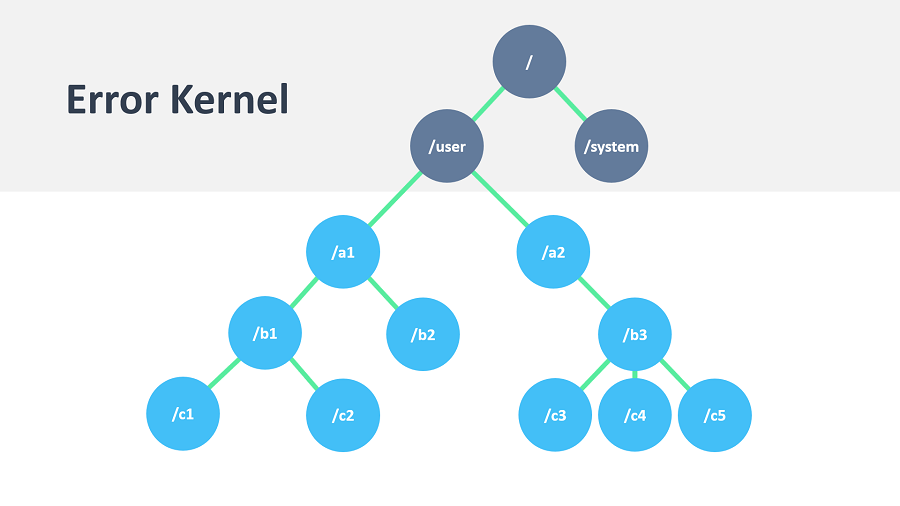

# Actor系统

Actors 是封装状态和行为的对象，它们只通过交换放置在接收者邮箱中的消息进行通信。在某种意义上，Actors是面向对象编程的最严格的形式，通过Actors建模，比较好的是将他们视为人:设想一组人并分配子任务给他们，安排他们在组织结构中的职能和思考如何升级报告失败（所有的好处其实不是真正与人打交道，这意味着我们不需要关心他们的感情状态或道德问题）。结果可以作为构建软件实现的心理支架。

> [!注]一个actor system是一个重量级的结构，将分配1…n个线程，所以一个逻辑应用创建一个系统。

## 层次结构

和经济组织一样，Actor自然形成层次结构。一个Actor，要监督程序中的某个功能，可能会想把它的任务分解成更小、更易于管理的部分。为此，它启动了它监督的子角色。在这里详细说明监督的细节时，我们将集中讨论本节中的基本概念。唯一的先决条件是要知道每个Actor都有一个监督者，即创建它的Actor。

Actor System最典型的特点是任务被拆分和委托，直到它们变得小到可以一块处理。这样做不仅任务本身结构清晰，而且产生的Actor可以根据它们应该处理的消息、如何正常响应以及如何处理失败进行周密思考。如果一个Actor没有处理某个情况的手段，它就会向上级传达相应的失败信息，寻求帮助。递归结构允许在正确的级别处理失败。

与分层编程设计比较，亦即比较容易陷入不漏任何失败的目标的防御性编程：如果问题传达给正确的人，可以发现一个更好的解决方案，如果试图让一切在“地毯之下”。

现在，设计这样一个系统的困难在于如何决定谁应该监督什么。当然，没有一个最好的解决方案，但有一些指导方针可能会有所帮助：

* 如果一个Actor管理另一个Actor所做的工作，例如通过传递子任务，那么Actor Manager 应该监督子Actor。原因是，管理者知道什么样的失败是预期的，以及如何处理他们。
* 如果一个Actor携带了非常重要的数据（如果可以避免的话，它的状态就不会丢失），这个Actor应该将任何可能危险的子任务源于它所监督的子Actor，并酌情处理这些子子Actor的失败。根据请求的性质，最好为每个请求创建一个新的子对象，这简化了用于收集答复的状态管理。这被称为Erlang的“错误内核模式”。
* 如果一个Actor依赖另一个Actor其职责，则应该注意到其他Actor的活跃度，并在接到终止通知时采取行动。这与监督不同，因为观察方对监督策略没有影响，应该注意的是，单凭功能依赖性并不是决定将某个子角色放在层次结构中的标准。

当然，这些规则都有例外，但无论你是遵守规则还是违反规则，你都应该有理由。

## 配置容器

Actor 系统作为一个合作的Actor全体是管理共用设施如调度服务，配置、日志等的自然单元.几个不同配置的Actor系统可没有问题地共存于相同的运行时下，在akka.net本身内没有全局共享状态。将这一点与在一个节点或跨网络连接中的Actor系统之间的透明通信联系起来，以看出Actor 系统本身可以用作功能层次结构中的构建块。

## Actor 最佳实践

1. Actor应该像好的同事：有效完成工作而没有别人的毫无必要的，避免占用资源。转换为编程，这意味着以事件驱动的方式处理事件并生成响应（或更多请求）。在某些外部实体（可能是锁、网络套接字等）中，参与者不应该阻止（即被动地等待线程），除非是不可避免的。
2. 不要在演员之间传递可变对象。为了确保这一点，喜欢不可变的消息。如果通过将其易变状态暴露到外部，就会破坏参与者的封装，那么您就回到了正常的.NET并发领域，并有所有的缺点。
3. Actor被认为是行为和状态的容器，接受这种方式不经常在消息中发送行为。其中一个风险是在演员之间偶然共享可变状态，而这种对演员模型的违反不幸打破了所有使演员在节目中获得如此美好体验的特性。
4. 顶级Actor是"错误内核"的核心部分，所以要谨慎地创建它们，并且更喜欢真正的分层系统。这在故障处理方面有好处（既考虑配置的粒度和性能），也减少了守护参与者的压力，如果过度使用，则是单个争用点。

## 阻塞需要精心管理

在某些情况下，执行阻塞操作是不可避免的，即将线程放入一个不确定的时间休眠，等待外部事件发生。示例是遗留的RDBMS驱动程序或消息传递API，其根本原因通常是（网络）I/O发生在封面下。当面对这种情况时，您可能会想在将来包装阻塞调用，然后使用它，但是这个策略太简单了：当应用程序在增加的负载下运行时，您很可能会发现瓶颈或耗尽内存或线程。

关于“阻塞问题”的充分解决办法的非详尽清单包括以下建议：

* 在一个参与者（或由路由器管理的一组参与者）中进行阻塞调用，确保配置一个线程池，该线程池是专门用于此目的或足够大小的线程池。
* 在任务中执行阻塞调用，确保在任何时间点调用此类调用的上限（提交无限数量的此类任务将耗尽内存或线程限制）。
* 在任务中执行阻塞调用，提供一个线程池，该线程池的线程数量与应用程序运行的硬件相匹配。
* 指定一个线程来管理一组阻塞资源，并在它们作为参与者消息发生时发送事件。

第一种可能性特别适合于单线程的资源，比如数据库句柄，传统上只能一次执行一个未完成的查询，并使用内部同步来确保这一点。一个常见的模式是为N个角色创建一个路由器，每个路由器包一个DB连接，并处理发送到路由器的查询。然后必须对N进行调整以获得最大吞吐量，这取决于哪个DBMS部署在什么硬件上。

> [!注]配置线程池是一个任务，最好委托给Akka.NET，简单地配置在application.conf和实例化通过actorsystem。
你不应该关心的事

参与者系统管理它配置的资源，以便运行它包含的参与者。在一个这样的系统中可能有数以百万计的参与者，毕竟他们的口头禅是把它们看作是丰富的，它们在每个实例上的开销大约只有300字节。当然，消息在大系统中处理的确切顺序是应用程序作者无法控制的，但这也不是有意的。退后一步，放松的同时，akka.net是否繁重罩下。
